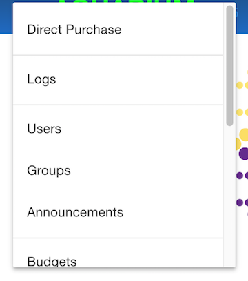
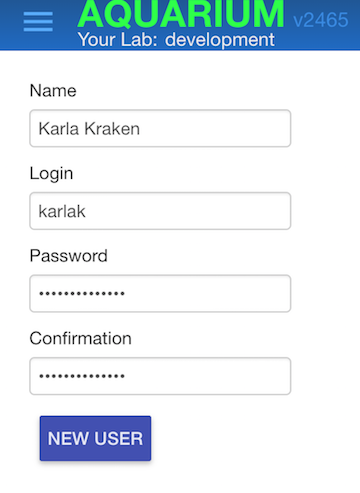
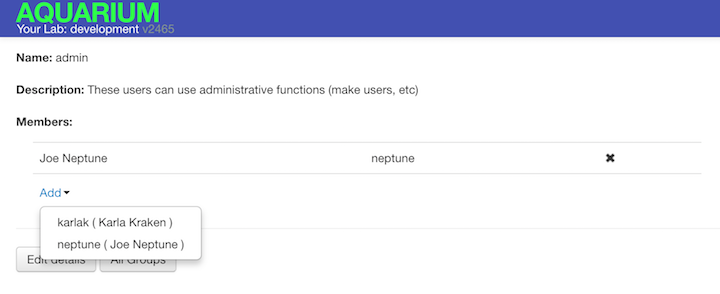

# Aquarium Configuration

## Table of Contents

<!-- TOC -->

- [Aquarium Configuration](#aquarium-configuration)
    - [Table of Contents](#table-of-contents)
    - [Installing Aquarium](#installing-aquarium)
    - [Create an Aquarium Account](#create-an-aquarium-account)
    - [Adding users in Aquarium](#adding-users-in-aquarium)
    - [Building the Inventory](#building-the-inventory)
    - [Mapping the Lab](#mapping-the-lab)
        - [Bench Locations](#bench-locations)
        - [Sample Locations](#sample-locations)
        - [Location Wizards](#location-wizards)
            - [Defining a New Wizard](#defining-a-new-wizard)
            - [Associating a Wizard with an Object Type](#associating-a-wizard-with-an-object-type)
            - [Moving Items](#moving-items)

<!-- /TOC -->

## Installing Aquarium

We recommend that labs doing protocol development run at least two instances:
the first, a "nursery" server that is shared within the lab for the purposes of trying out protocols under development, while the second is the production server that controls the lab.
We use this arrangement in the Klavins lab to run the UW BIOFAB so that protocols can be evaluated without messing up the actual lab inventory.
In addition, each protocol developer should run a local instance, which can be done easily with Docker.

See the [installation instructions](installation) for details.

## Create an Aquarium Account

The dockerized development server already has an adminstrative user with login `neptune` and password `aquarium`.
But if you are running Aquarium from source, you will need to create one.

To create the first administrative user run the commands

```bash
RAILS_ENV=production rails c
load 'script/init.rb'
make_user "Your Name", "your login", "your password", admin: true
```

from the `aquarium` directory.

## Adding users in Aquarium

Once you have an account you can create other users by choosing `Users` in the menu at the top left of the Aquarium page:



Then enter the user information and click **New User**



This will bring you to the user information page where user contact information should be entered:


The exclamation points on this page indicate that the user hasn't provided contact information, and has not agreed to usage terms.
The user will need to login separately to agree to the usage terms.

A user must have administrative priviledge to access the protocol development tools.
For this, choose **Groups** from the settings menu, choose the group, and then click add:



Also, a user must have an associated budget to run any workflows.

## Building the Inventory

## Mapping the Lab

Aquarium uses locations

### Bench Locations

If an item is stored on a shelf, drawer, etc, it will have a location of the form B1.510, which in this case means Bay 1, location 510.
The first digit of 510 is the height from the floor, with the 300s being bench level.
Thus, 500 is two shelves up from the bench.
The second two digits, in this case 10, show where on the shelf going from left to right across the bay.
So B1.510 means bay 1, second shelf above the bench, near the left most side of the bay.
There are stickers that should guide you to the exact spot.

### Sample Locations

Samples are stored using various prefixes, which are handled by the Location Wizard, a piece of software that determines the next available location for a newly minted sample.
Any ObjectType can be associated with a prefix which then determines the behavior of the Location Wizard.
The association of ObjectType to prefix can be made on either the 'New ObjectType' or 'Edit ObjectType' page.

All sample locations have the form PR.x.y.z where PR is one of the prefixes described below, and x, y and z are location identifiers that have specific meanings according to the prefix.
As an example, if a sample has the location M20.4.5.87, then it is stored in a -20C freezer in hotel 4, box 5, slot 87.

The currently recognized prefixes and their behaviors are as follows.

- `M20.x.y.z` The -20C sample space is separated into aluminum hotels, numbered x=0,1,2, ....
  The number of hotels is essentially unlimited (we'll buy more as we need them).
  Which hotels are in which freezer should be shown on the door of the freezer.
  Each hotel holds y=0..15 boxes, and each box has z=0..99 slots numbered from the upper left, then accross the top row ro slot 9, then to the left of the next row for 10-19, etc.
  When a new sample is made in an ObjectType with prefix M20, the location wizard determines the new address by finding the next slot in the box with samples of the same project (a.k.a. category), or a new box if such box is full.
  Thus, only samples with for the same project will be found in a given box.

- `M80.x.y.z` The -80C sample space is organized the same way as the -20C sample space.

- `DFS.x.y.z` The deli fridge sample space is organized the same way as the -20C sample space.

- `SFw.0.y.z` There are a number of small -20C freezers in the lab number SF1, SF2, ...
  These each contain boxes, numbered y=0,1,2,...
  The location wizard puts new samples stored in ObjectTypes with prefix SF1, SF2, etc into boxes according to project by assigning the next available slot, which might be in a new box if the current project boxes are full.

### Location Wizards

A location wizard is a bit of code that uses a schema to store new items.
For example, Primers might be stored in a -20C freezer in 81 slot freezer boxes stored on shelves that contain 16 boxes.
A location wizard for this scheme would have locations of the form M20.x.y.z where x is the shelf (or hotel as we call them in the Klavins lab), y is the box, and z is the slot in the box.

A wizard works by setting up a table of all locations with the specified form that have evern been used.
When a new item is made, the wizard finds the lowest available location for that item.
Here W.x.y.z < W.X.Y.Z if x < X, or x=X and y<Y, or x=X and y=Y, and z<Z.
If all available locations are taken, then wizard computes the next new location, adds it to the table of locations, and puts the item there.

#### Defining a New Wizard

The interface for creating a new location wizard can be found under the Inventory menu.
There you can click "New Wizard".
The wizard name should be short, such as "M20" as it will be used as the first part of the location.
The description can be a sentence or so.
The field names are used to remind the user what each field means.
In the example above, we would use "Hotel", "Box", and "Slot".
The capacity for the second two fields can be a finite, positive number.
In the above example, we would use 16 for the Box field and 81 for the Slot field.
The first field is always assumed to have infinite capacity (meaning you can go buy more freezers as you need them).

#### Associating a Wizard with an Object Type

Go to the object type's edit page, or new page if you are creating a new object type, and enter the name of the wizard in for the "Location Prefix" field.
All new items with that object type will use the wizard associated with that name, if there is one defined.
Note that multiple object types can use the same wizard.
For example, we store Primer Aliquots, Primer Stocks, Plasmid Stocks, etc. in the same type of freezer box.

#### Moving Items

In both the sample page and the item page, you can enter in a new location for an item.
If the location has the form of a wizard location, then it must be empty for you to move the item there, otherwise Aquarium will not let you move it.
You can also set the location to some other string, such as "Bench".
Doing so will take the item out of the wizard's control.
You can also put it back under wizard control by moving it to an empty location of the form managed by the associated wizard.
