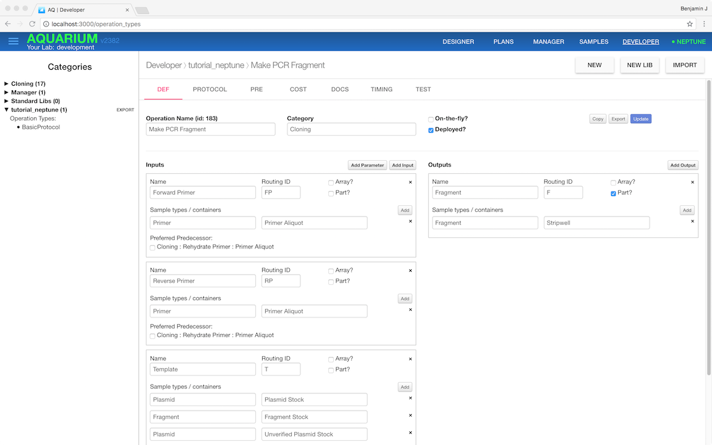
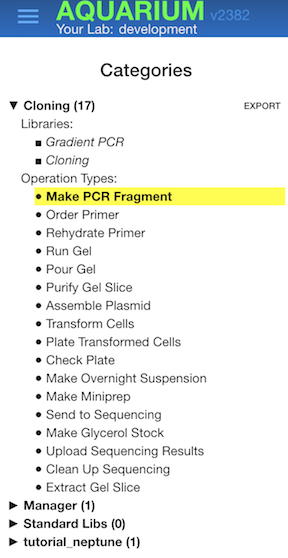
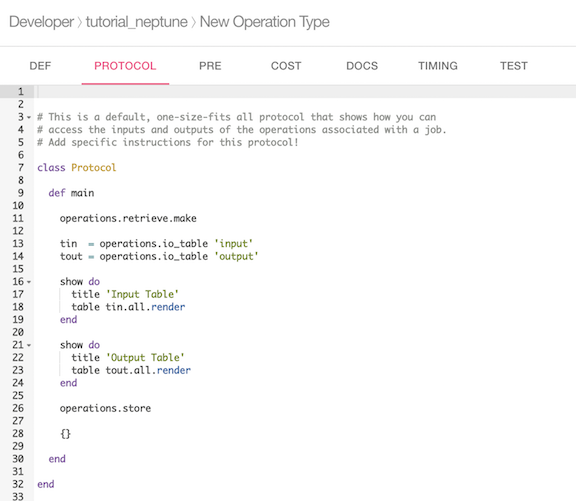
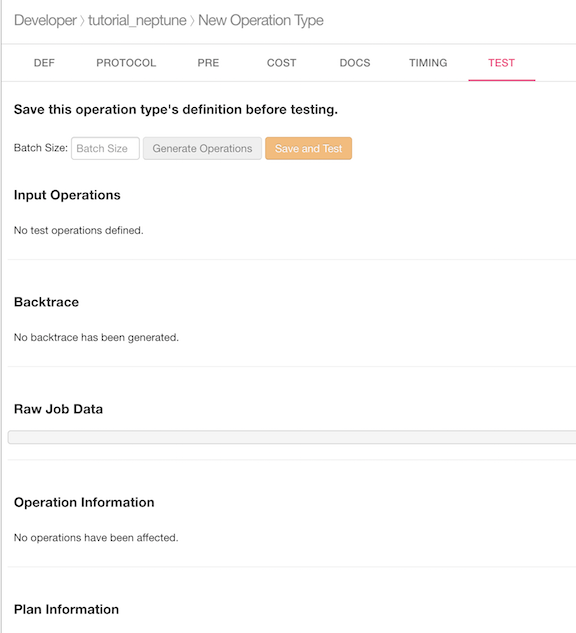

# Aquarium Protocol Development

These guidelines are for building protocols to run in Aquarium.
For documentation about working on Aquarium itself see the [Aquarium Developer Guidelines](aquarium_developer).

## Table of Contents

<!-- TOC -->

- [Aquarium Protocol Development](#aquarium-protocol-development)
    - [Table of Contents](#table-of-contents)
    - [Introduction](#introduction)
    - [Writing Protocols](#writing-protocols)
    - [Developer Tools](#developer-tools)
        - [Working in Aquarium](#working-in-aquarium)
        - [Working with External Tools](#working-with-external-tools)

<!-- /TOC -->

## Introduction

A _protocol_ in Aquarium is the code that generates the instructions that the technician will follow.

To develop Aquarium protocols you will need to

- [setup an Aquarium server to work with](../configuration/installation),
- learn how to write protocols,
- understand the development tools.

## Writing Protocols

Protocols are written in the _Krill protocol language_, a domain specific language built using Ruby.
The [Protocol tutorial](protocol_tutorial) gives an overview of using Krill to define protocols, and assumes a basic understanding of Ruby.

If you are not familiar with Ruby, a good place to start is the [Ruby page](https://www.ruby-lang.org/en/) that has links to introductory tutorials as well as general documentation.
There are also courses on Ruby that are available online, which may be the place to start if you don't already know how to program.

For the more advanced coding useful for library development, you should learn about object-oriented design.
The [POODR](http://www.poodr.com) book is a good resource.

## Developer Tools

Aquarium has a Developer tab that supports creating and editing new protocols, though it is also possible to work on protocols outside of Aquarium.

Developers actually create an _operation type_, which includes the protocol as code along with several other components that are described below.

### Working in Aquarium

The Developer tab is the interface for working with operation types in Aquarium.
Clicking on the Developer tab in Aquarium brings you to a view similar to this one.
On the left is the list of operation types and libraries organized by category, and the right pane is the operation type definition view.
When you open the tab, the definition for the first operation type in the first category is displayed; in this case, the `Make PCR Fragment` operation type from the `Cloning` category.

Under each category, the libraries and operation types defined in that category are listed.
Clicking on the name of the library or operation type will open the definition in the view on the right.

Clicking on `New` creates a new operation type (`New Lib` creates a new library), and opens the definition view.

This allows you to set the operation type and category type names.

[details]

Clicking on the **Protocol** tab opens the protocol editor.
For a new operation type a default protocol is added to the editor when you first open it.
[Keyboard shortcuts](https://github.com/ajaxorg/ace/wiki/Default-Keyboard-Shortcuts) are available.

Be sure to click **Save** at the bottom of the page before switching from the Developer tab.

Clicking on the **Pre** tab shows the precondition for the operation type in a new editor.
A default precondition that always returns `true` is created for new operation types.

The **Cost** tab shows the cost model for the operation type, which is function on an `Operation`.
This function returns a map object with costs for `labor` and `materials` keys.
The default function added for new operation types returns zero for both.

The **Docs** tab shows another editor, but this time for Markdown documentation for the operation type.

The **Timing** tab indicates when the operation type should be run in the lab.

The **Test** tab provides a way to run a quick test with the protocol.
To run a test, specify the `Batch Size`, the number of operations to batch, click **Generate Operations** and then **Test**.
This will generate random inputs for the operations and run the protocol.

Note that running tests this way doesn't allow testing assertions.
Also, don't use the test tab on a production server.

### Working with External Tools

Because Aquarium protocols are written in a Ruby DSL, you can edit protocols outside of Aquarium and copy them in.
This allows you to use an editor that you are comfortable with, and also use tools such as [Rubocop](https://rubocop.readthedocs.io/en/latest/) to check for issues in your protocol code.
Many developers simply cut and paste the whole protocol or library code between the Aquarium and external editors.

The [Parrotfish](http://klavinslab.org/parrotfish) tools currently being developed make this a little easier, allowing protocols to be pushed and pulled from an Aquarium instance using the command line.
