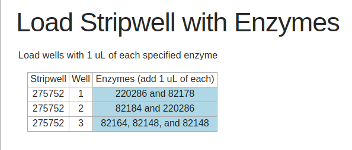

# Table Documentation

This is the documentation for generating and showing formatted `Tables`, for use in writing effective Aquarium protocols.

This page will give examples and instructions on how to get started using `Tables`, but it is not a comprehensive reference for all `Table` related methods. 
See the [API documentation](../../../api/index.html) for more details on the functions that Krill provides.

If you haven't already, visit the [protocol developer documentation](../protocol_developer) for information about getting started.

---

## Table of Contents

<!-- TOC -->

- [Table Documentation](#table-documentation)
    - [Table of Contents](#table-of-contents)
    - [Tables for Showcasing Data](#tables-for-showcasing-data)
    - [Tables on OperationList](#tables-on-operationlist)
        - [Mapping Operations to Respective Inputs or Outputs](#mapping-operations-to-respective-inputs-or-outputs)
        - [Mapping Operations to Arbitrary Atributes](#mapping-operations-to-arbitrary-atributes)
        - [Accepting Technician Input through Tables](#accepting-technician-input-through-tables)
    - [Standalone Tables](#standalone-tables)

<!-- /TOC -->

## Tables for Showcasing Data

Often in a protocol it is useful to show a summarizing visualization of a lot of data at once. In Krill, `Tables` are an easy to use object that can accomplish this. Here is an example of a `Table` as seen from the technician view during a restriction digest protocol, which instructs the technician to add the appropriate enzymes to the correct well of the correct stripwell. A table is particularly useful here, where each operation can be parameterized with a different set of enzymes.



Inside a `show` block, a `Table` like this is displayed to the user with the `table` flag -- `table` is a flag just like `note`, `warning` and `image` which are interpreted by the `show` block to display the argument passed with it in a certain way. While `note` accepts a `String` argument and `image` expects a path to an image, The `table` flag accepts a `Table` object. Supposing that we already have a successfully generated `Table` stored in the variable `enzyme_tab`, showing it to the technician is simple

```ruby
show do
    title "Load Stripwell with Enzymes"
    
    note "Load wells with #{VOL_OF_ENZYME} uL of each specified enzyme"
    
    table enzyme_tab
end
```

The rest of this documentation will be focused on how to generate these table objects.

## Tables on OperationList

Aquarium protocols are designed to work on arbitrarily large batches of `Operations` at once, so it is often the case that you will want to design a `Table` where some information about each operation is represented by a row of the table. The `Table` shown in the example picture above uses this paradigm.

`OperationList` has many instance methods which make generating row-per-`Operation` style `Tables` a simpler process. Creating a `Table` from an `OperationsList` relies on _method chaining_ these instance methods. To begin the table generation process, `start_table` is called on an `OperationsList`, returing a intermediary Table-like object which is initially has one row for every `Operation` in the list, and zero columns. Further methods may be called on this intermediary object to add columns to the `Table`. When all desired columns have neen added, `end_table` is called to finish the method chain and return a usable `Table` object which is ready to show to the technician.

To create a `Table` with one column, called `simple_tab`
```ruby
    simple_tab = operations.start_table.input_item("Plasmid").end_table
```

When `simple_tab` is correctly displayed within a show block, in a `Job` of 5 `Operations` the technician might see something like this


### Mapping Operations to Respective Inputs or Outputs

TODO [.input, .input_item, .input_collection, heading:, checkable:]

### Mapping Operations to Arbitrary Atributes

TODO [custom column]

### Accepting Technician Input through Tables

[Custom Input, validate, validation_message]

## Standalone Tables
TODO [Table.new, custom column, custom input, simple 2darray tables]

